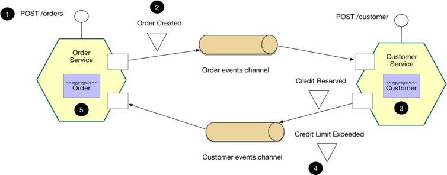
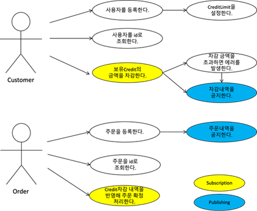
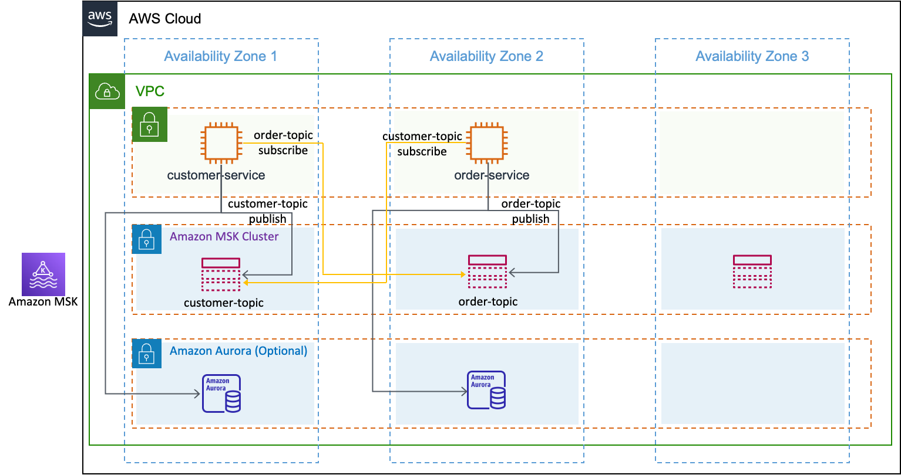

<h2>아키텍처</h2>

<h2>개발환경</h2>
JDK 1.8 이상\
AWS MSK(Managed Streaming for apache Kafka)2.6.2\
AWS EC2

<h2>컴파일</h2>
cd customer-service\
./gradlew build

cd order-service\
./gradlew build

<h2>접속 URL</h2>
- 고객: http://localhost:8081/customer-order/customer-service/swagger-ui/index.html
- 주문: http://localhost:8082/customer-order/order-service/swagger-ui/index.html

<h2>시나리오</h2>
EDA 워크샵에서 사용할 서비스는 고객(Customer)와 주문(Order) 2개의 서비스로 구성되어 있으며 신규 고객을 등록할때 이름(Name)과 그 고객이 사용수 있는 선지불금(Credit)을 입력합니다. 고객이 등록되고 나면 고객ID(Customer ID)를 리턴 받습니다. 주문(Order)은 이 고객ID를 이용해 할 수 있으나 보유한 선지불금(Credit) 내에서 할 수 있습니다. 만약 고객ID에 있는 Credit을 초과하는 주문을 했을 경우 주문은 취소되고 선지불금은 주문 이전의 금액으로 원복되어야 합니다.

이 시나리오의 유즈케이스 다이어그램은 아래와 같습니다.

이 워크샵 시나리오를 통해 살펴볼 내용은 고객(Customer) 서비스와 주문(Order) 서비스가 어떻게 Loose Coupling 되어 있는지 이해하도록 합니다. 또한 각 서비스(마이크로서비스)간 Happy Path 내에서 Transaction 관리를 어떻게 하는 지 이해하도록 합니다.

주) 이 예제에서는 2022년 6월 이후 AWS에 적용된 새로운 UI 환경 기준으로 설명합니다.
주) 주문(Order)서비스는 주문 테이블에 상태 플래그가 있으며 주문이 들어 왔을때는 (pending), 주문이 성공하면 (Success), 주문이 실패하면 (Fail) 을 표시할 수 있습니다.

워크샵 아키텍처
본 EDA 워크샵에서는 3개의 AZ에 1개의 Public Subnet, 2개의 Private Subnet을 구성할 것이며 Public Subnet에는 2개의 EC2 인스턴스가 서로 다른 AZ에 있도록 구성할 겁니다.
Private Subnet에는 Amazon MSK Cluster를 3개의 AZ에 걸쳐 구성할 예정이며 실습을 위해 1개의 파티션이 2개의 Topic을 구성해 MKS를 테스트해 볼 예정입니다.
Database는 Spring Boot에서 In-Memory DB인 H2 DB를 각각의 EC2 인스턴스에서 사용할 수 있도록 구성하는 것이 Defalut 실습이고 Optional로 H2을 대신해 Private Subnet에 Amazon Aurora(MySQL)를 이용해 2개의 Aurora Cluster를 구성해 실습하는 방법도 소개하고 있습니다.

EC2인스턴스에서 구동되는 customer-service와 order-service는 ECR이나 EKS와 같은 Container로 확장될 수 있습니다. 실습을 빨리 끝내시는 분들은 ECR이나 EKS로 워크샵의 아키텍처를 확장해 구현해 보는 것을 권장 드립니다

